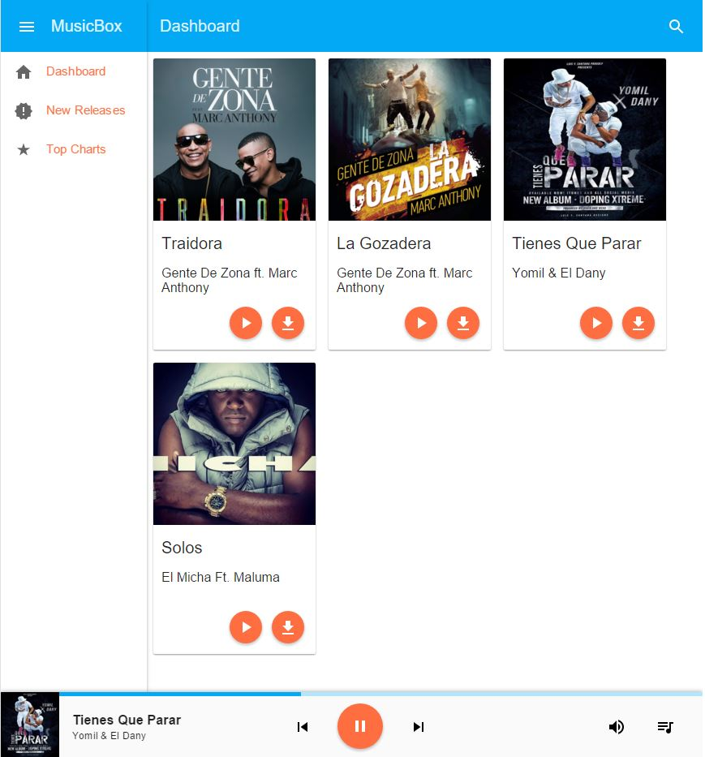

# MusicBox

#Url
http://www.cubanmusicbox.com

##Description
A music streaming/listening website primarily targeting Cuban Reggaeton. 

##Horizontal Prototype
The following image describes the main dashboard view of the site.

##Usage
This project requires the following technogologies:
 * NPM (Node pakcage manager)
 * Bower (Client side dependency management) 
 * AngularJS
 * Angular Material
 * Node.js / Espress.js
 * DynamoDB

To contribute/run follow these steps:
 * Run ``git clone https://github.com/fescalona4/musicBox.git``
 * cd /musicBox 
 * Run ``npm install``
 * Run ``bower install`` 
 * Run ``node server.js`` 

